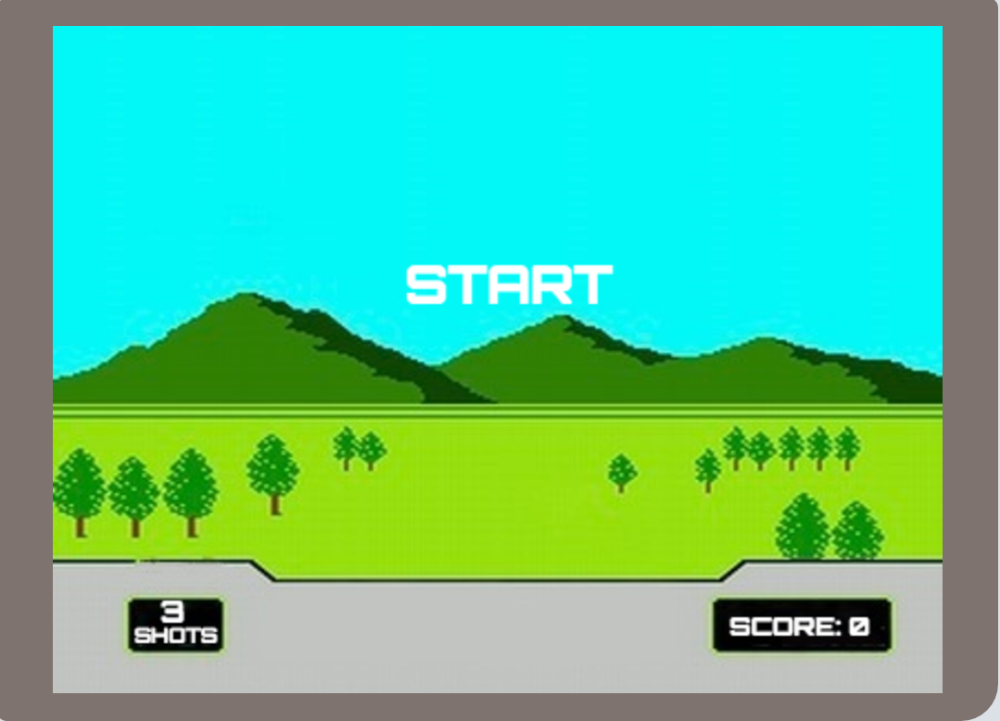
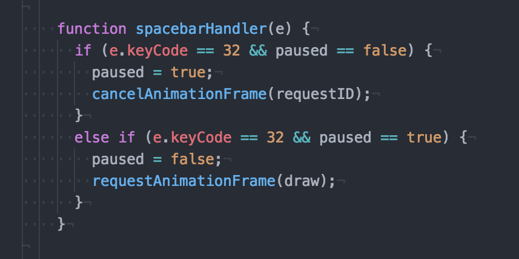

# ClayShooting

## Background

Clay Shooting is a classic Nintendo game (part of Duck Hunt).
Click to shoot the clay plates and score points with every hit.
Shots are you're lives and every time you shoot and miss, you loose one.
If you use all 3 shots, the game ends.

## Instructions

- Click to shoot the plates
- Spacebar: pause game

## Functionality

**Pause**

The gameplay pause feature works by setting a variable 'paused' to false as the default state. An event listener is setup for the spacebar and when pressed will check the paused state. If false, it will cancel the animation frame (thus freezing the game) and setting the paused state to true. If 'paused' is true when the spacebar is clicked, it uses requestAnimationFrame to continue the game.

**Discs**

The disc speed is much slower than the original Nintendo game for computer usability. It also has slightly decreased accuracy to enhance the user experience. To simulate the distance as the disc 'gets further away' the size of the disc is decreased every frame. Once the disc is out of sight or has been shot, it resets.

**Design**

The color theme and odd box shape bordering the game are based on the original gameboy to give it that retro feel. Take a trip back to the 90s.
